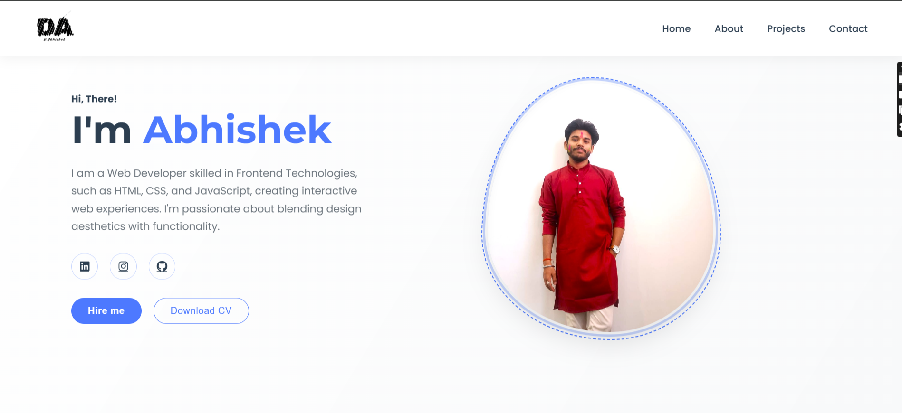

# Abhishek's Portfolio Website

A modern, responsive personal portfolio website showcasing my skills, projects, and contact information. Built with HTML, CSS, and JavaScript, this portfolio features a clean design with smooth animations and interactive elements.

## Features

- **Responsive Design**: Fully responsive layout that adapts to all screen sizes
- **Modern UI/UX**: Clean interface with smooth transitions and hover effects
- **Interactive Elements**: Animated social icons, buttons, and navigation
- **Project Showcase**: Dedicated section to highlight my web development projects
- **Contact Form**: Easy-to-use contact form for potential clients or employers
- **Social Media Integration**: Direct links to my professional profiles
- **Dark Blue Theme**: Professional dark theme with blue accent colors

## Sections

### Navigation
A fixed navigation header with links to all major sections of the portfolio.

### Hero Section
An eye-catching introduction with my name, role as a Web Developer, and brief description of my skills in frontend technologies.

### About Section
Personal introduction with my profile image, educational background (BCA student at Arcade Business College, affiliated to Patliputra University), and my passion for web development.

### Projects Section
Showcase of my web development projects including:
- Restaurant Website (HTML, CSS, Bootstrap, JavaScript)
- Gamics - Gaming Website (HTML, CSS, JavaScript)
- Temperature Converter Application (HTML, CSS, JavaScript)

### Contact Section
A dual-column contact section with a form for inquiries and personal contact information including:
- Email: abhishek.kumar0120f@gmail.com
- Phone: +91 9386363612
- Location: Patna, Bihar
- Links to GitHub and LinkedIn profiles

## Technical Implementation

### CSS Features Used
- CSS Variables for consistent theming
- Flexbox for responsive layouts
- CSS Transitions and animations for interactive elements
- Media Queries for responsive design
- Custom styling for form elements and buttons

### Responsive Design
The portfolio is fully responsive with optimized layouts for:
- Mobile devices (< 768px)
- Tablets and desktop (≥ 768px)

On mobile devices, the layout adjusts with stacked sections and modified navigation for better usability.

### Social Icons Enhancement
The social media icons feature:
- Circular border design
- Smooth hover transitions
- Background color change on hover
- Subtle animation effects

## How to View

The portfolio is hosted online and can be viewed at [portfolio-url.com](https://portfolio-url.com)

Alternatively, you can run it locally:
1. Clone this repository
2. Open `index.html` in your browser

## Connect With Me

- LinkedIn: [https://www.linkedin.com/in/abhishek-kumar012/](https://www.linkedin.com/in/abhishek-kumar012/)
- GitHub: [https://github.com/dabhigithub](https://github.com/dabhigithub)
- Instagram: [https://www.instagram.com/_d_abhi_01/](https://www.instagram.com/_d_abhi_01/)
- Email: abhishek.kumar0120f@gmail.com

## Future Enhancements

- Blog section to share web development insights
- Dark/Light theme toggle
- Additional project category filtering
- Animation improvements
- Project detail pages

---

© 2025 Abhishek Kumar. All Rights Reserved.
